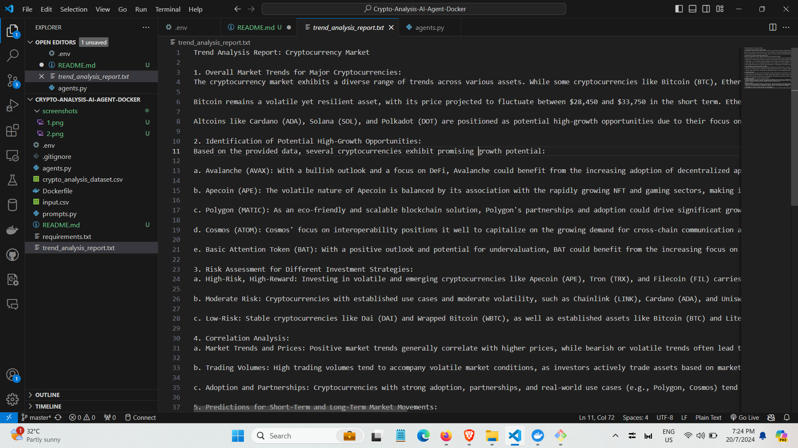

### Screenshots





**Inspired by Docker Hub image:**

To pull the latest version, use the following command:

```sh
docker pull davidondrej1/dataset-agent:latest
```

# Cryptocurrency Analysis AI Agent

This project implements an advanced AI agent for cryptocurrency market analysis using Docker and the Anthropic API. The agent analyzes existing cryptocurrency data, generates synthetic market data, and provides trend analysis.

## Features

- Analyzes input CSV files containing cryptocurrency market data
- Generates synthetic market data based on the analysis
- Provides trend analysis and investment recommendations
- Containerized using Docker for easy deployment and scalability

## Prerequisites

- Docker installed on your system
- An Anthropic API key

## Usage

1. Clone the repository:
   ```
   git clone https://github.com/naimkatiman/Crypto-Analysis-AI-Agent-Docker.git
   cd Crypto-Analysis-AI-Agent-Docker
   ```

2. Build the Docker image:
   ```
   docker build -t naimkatiman/crypto-analysis-agent:latest .
   ```

3. Run the Docker container:
   ```
   docker run -it --rm -v /path/to/your/data:/app/data naimkatiman/crypto-analysis-agent:latest
   ```
   Replace `/path/to/your/data` with the path to the directory containing your input CSV file.

4. When prompted, enter:
   - Your Anthropic API key
   - The name of your input CSV file (e.g., "input.csv")
   - The number of rows you want in the new dataset

5. The agent will generate two output files in the same directory as your input file:
   - `crypto_analysis_dataset.csv`: The generated synthetic market data
   - `trend_analysis_report.txt`: A detailed trend analysis report

## Input File Format

The input CSV file should have the following columns:
Cryptocurrency, Market Trend, Current Price (USD), Predicted Price (USD), Market Sentiment, Investment Opportunity, Risk Level, Strategic Advice

## Output

The agent produces two main outputs:

1. A new CSV file with generated market data, including additional columns for Date, Trading Volume, and Market Cap.
2. A trend analysis report providing insights on market trends, potential high-growth opportunities, risk assessment, and investment recommendations.

## Contributing

Contributions to improve the AI agent or extend its capabilities are welcome. Please feel free to submit pull requests or open issues for bugs and feature requests.

## License

This project is licensed under the MIT License - see the [LICENSE](LICENSE) file for details.

## Disclaimer

This AI agent is for educational and research purposes only. It does not constitute financial advice. Always conduct your own research and consult with a qualified financial advisor before making investment decisions in the cryptocurrency market.